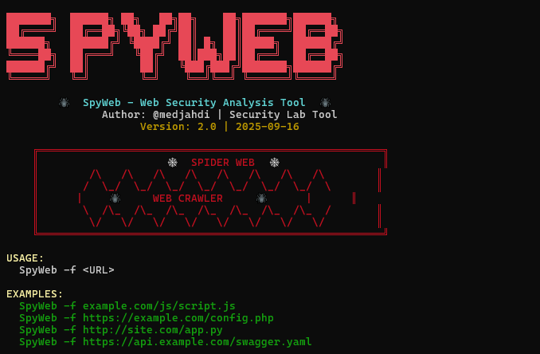

# 🕷️ SpyWeb - Web Security Analysis Tool



## 🔎 Overview
**SpyWeb** is a lightweight **web security analysis tool** written in **Bash**.  
It crawls and scans files (local or remote) to detect **sensitive information leaks** such as:
- API keys & tokens
- Cloud provider keys
- Social media tokens
- Database credentials
- JWT tokens
- Private keys & certificates
- Emails, passwords, IP addresses, credit cards
- URLs & endpoints

## ⚡ Features
- Crawl and download remote files (`.js`, `.php`, `.py`, `.json`, `.env`, etc.)
- Detect sensitive data patterns using enhanced regex rules
- Highlight findings with colored output
- Summarized security report at the end of the scan
- Supports both `curl` and `wget`

## 🛠️ Usage
```bash
# Run the tool
./spyweb.sh -f <URL>
```
# Examples
./spyweb.sh -f example.com/js/script.js
./spyweb.sh -f https://example.com/config.php
# 📂 Supported File Types
- Web Files: .js, .php, .html, .css
- Data Files: .json, .xml, .yaml, .csv
- Config Files: .env, .ini, .conf, .cfg, .toml
- Programming: .py, .java, .ts, .swift, .kt, .dart
- DevOps & Build: Dockerfiles, CI/CD files, .sh, .ps1, .tf
- Databases: .sql, .db, .sqlite
- Security: .pem, .crt, .p12

# 🚀 Installation
```bash
git clone https://github.com/your-username/spyweb.git
cd spyweb
chmod +x spyweb.sh
./spyweb.sh -f https://target.com/file.js
```
# ⚠️ Disclaimer

This tool is for educational and security research purposes only.
Do not use it against systems without explicit authorization.
The author is not responsible for any misuse.

# 👤 Author: @medjahdi

